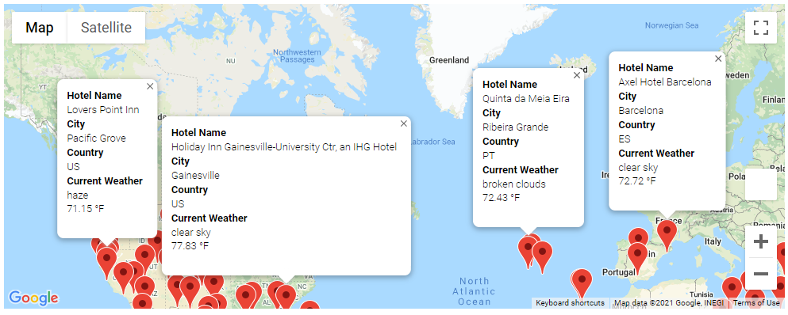

# World_Weather_Analysis

## Overview
The purpose of this project was to apply analysis, visualizations, and statistical skills while retrieving specific data from a website through an Application Programming Interface (API).  For this project our goal was to collect and present data for a hypethetical travel company called PlanMyTrip from customers via the search page; from the search page, customers will then filter based on their preferred travel criteria in order to find their ideal hotel anywhere in the world.  In this project we used Jupyter Notebook, Pandas Library, CitiPy, Python Requests, APIs, and JSON Traversals to collect weather data from a large number of cities and plot the data using the matplotlib library.  

## Results
Using the OpenWeather API and Google Maps API we were able to create a map containing current weather information and the nearest hotel for over 1500 unique locations worldwide.

Our next task was to get input from the customers on what the maximum and minimum temperatures are that they would prefer while on their vacation.
The next task was to create a trip itinerary where the starting location and the ending location would be the same with three waypoints along route.  For our demonstration we chose the route itinerary below.

Finally, we combined the hotel and weather information with the route itinerary that we chose, which can be seen in the map below.

## Summary
The ability for a customer to narrow down their potential vacation locations by inputting their desired temperatures is a feature that will enhance the user experience when they are planning their next get-a-way.  Add to that the ability to instantly find nearby hotel information to further customize their trip and suddenly the customer feels they have more control over their trip planning.  This is the type of ingenuity that can take PlanMyTrip or any travel company to great success.